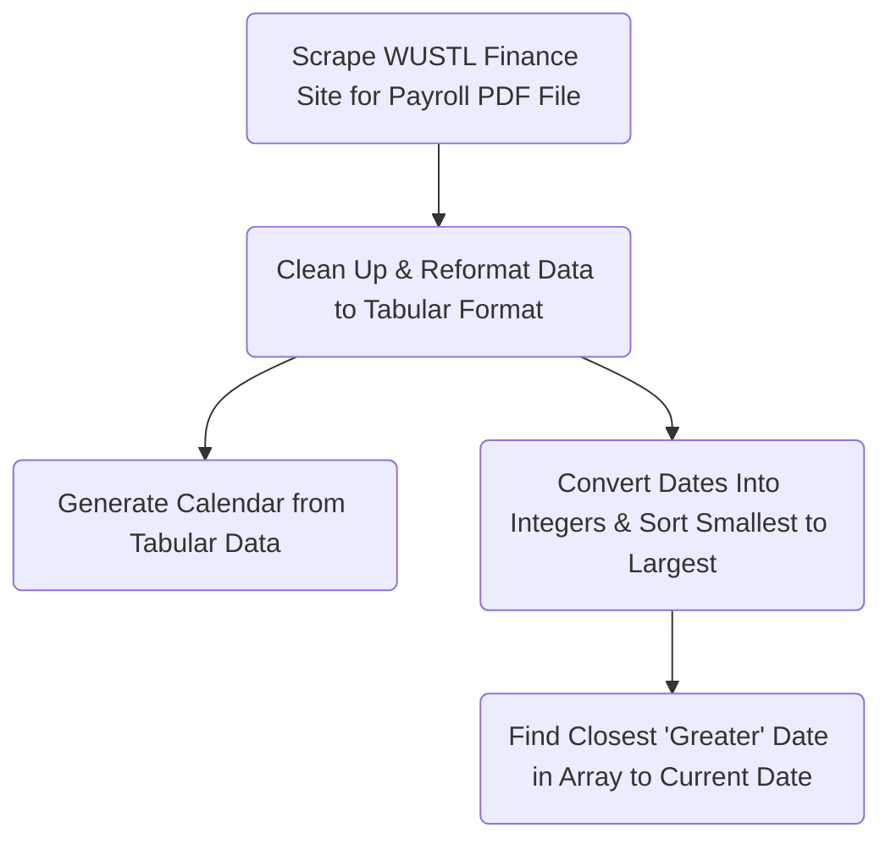

# When Am I Getting Paid?

This is a simple web app I created to not only tell WUSTL DBBS students when they are getting paid, but also generate an internet calendar file (`.ics`) to add to their personal calendar.

General Web App Mechanism:

